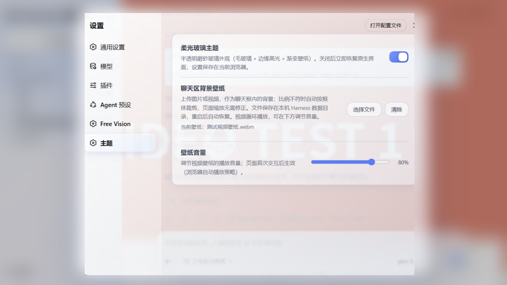
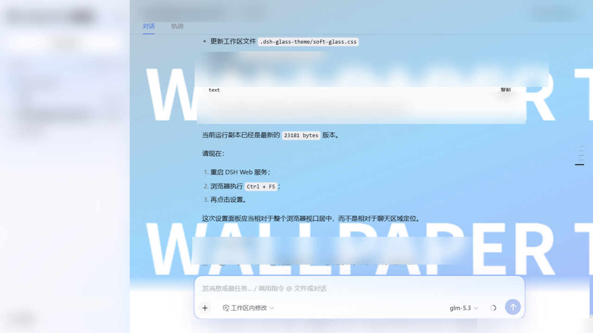

# dsh-glass-theme · 柔光玻璃主题

[English](#english) · [中文](#中文)

DeepSeek Harness (`@deepseek-ai/dsh`) 的玻璃拟态主题插件：磨砂半透明 + 边缘高光 +
内部渐变，参照小米澎湃 OS 4 Soft Light Glass 材质语言。自带设置界面，可一键
开关主题、为聊天框设置图片/视频壁纸并调节音量。

| 设置 → 主题 | 聊天区视频壁纸 |
| --- | --- |
|  |  |

## 中文

### 安装

```sh
# 一次性准备（dsh 的插件安装依赖 pnpm）
corepack enable pnpm        # 没有 corepack 时: npm i -g pnpm

# 一键安装
npx @deepseek-ai/dsh plugin --profile web add dsh-glass-theme
```

然后重启 `dsh web`，打开 **设置 → 主题** 即可使用。

如果 `plugin add` 不可用（旧版 dsh），可手动安装：

```sh
cd ~/.dsh/profiles/web
corepack pnpm add dsh-glass-theme
# 编辑 package.json，在 dsh.profile.bundles 数组里加入 "dsh-glass-theme"
```

**卸载**：`npx @deepseek-ai/dsh plugin --profile web remove dsh-glass-theme`，
或从 package.json 依赖与 bundles 里删掉后 `corepack pnpm install`。

### 使用

打开 **设置 → 主题**：

- **柔光玻璃主题**：总开关，即时生效；关闭后恢复原生界面。按浏览器记忆，
  刷新/重启后保持；
- **聊天区背景壁纸**：上传图片或视频，只铺在聊天框内（侧边栏不受影响）。
  比例不符自动按框体裁剪（cover），页面缩放零修正。文件保存在本机
  Harness 数据目录（`~/.dsh/dsh-glass-theme/`），**重启 Harness、重启浏览器
  都不会丢失**；
- **壁纸音量**：视频壁纸专用滑条（0–100%），即时生效；视频采用"静音起播，
  交互后放开声音"策略以兼容浏览器自动播放限制。

### 兼容性说明

皮肤通过当前 dsh 构建的 CSS-module 类名（如 `VOzbGW_panel`）精确定位元素。
dsh 大版本更新后这些 hash 可能变化，届时主题会**静默失效**（不会破坏布局），
按仓库内 README 的"hash 漂移适配流程"重新映射即可。设计令牌层（`--dsw-*`）
与壁纸功能不依赖这些 hash，通常不受影响。

### 工作原理 / 安全设计

- 客户端经 `window.__ModuleLoader__` 注入 `<style>`，全部选择器为精确
  类名，**不使用** `[class*=…]` 通配匹配与 `!important`，不改写任何
  position / 尺寸 / z-index —— 弹窗定位完全属于应用自身；
- `backdrop-filter` 只加在确认不含 fixed 弹层后代的内容卡片上；
- 设置区块经官方 slots 接口（`ctx.slots.inject("settings.section", …)`）
  注入，与 Free Vision 同款机制；
- 壁纸经插件服务端路由 `/dsh-glass-theme/wallpaper`（GET/POST/DELETE）
  存储，仅监听本机。

### 开发

```sh
# 修改 soft-glass.css 或 build-client.mjs 中的客户端模板后：
node build-client.mjs

# 重新部署到本地 profile 并重启
cd ~/.dsh/profiles/web
rm -rf node_modules/dsh-glass-theme      # pnpm 对未变化的 file: 依赖不会重拷
corepack pnpm install
cd -  && npx @deepseek-ai/dsh web
```

目录结构：`soft-glass.css`（样式源）→ `build-client.mjs`（嵌入模板生成
`client.js`）→ `dsh/index.js`（服务端：壁纸存取）。详细的安全规则与
hash 漂移适配流程见 [DEV.md](DEV.md)。

## English

A glassmorphism theme plugin for DeepSeek Harness: frosted-glass surfaces,
an in-app **Settings → 主题 (Theme)** panel with a one-click toggle, and a
chat-area image/video wallpaper with volume control.

### Install

```sh
corepack enable pnpm        # one-time; or: npm i -g pnpm
npx @deepseek-ai/dsh plugin --profile web add dsh-glass-theme
```

Restart `dsh web`, then open **Settings → 主题 (Theme)**.

### Features

- Frosted-glass theme (blur + edge highlight + inner gradients), light & dark
- One-click toggle, remembered per browser
- Chat-area wallpaper: image or video, auto-cropped (object-fit: cover),
  zoom-proof, stored server-side (`~/.dsh/dsh-glass-theme/`) so it survives
  browser and harness restarts
- Volume slider for video wallpapers (muted-start autoplay policy compatible)

### Compatibility

Selectors target CSS-module class names of your current dsh build; a dsh
upgrade may silently un-style (never break layout) until hashes are
re-mapped — see DEV.md.

## License

MIT — 设计语言参照小米澎湃 OS 4「柔光玻璃」材质规范，仅作样式灵感致意。
